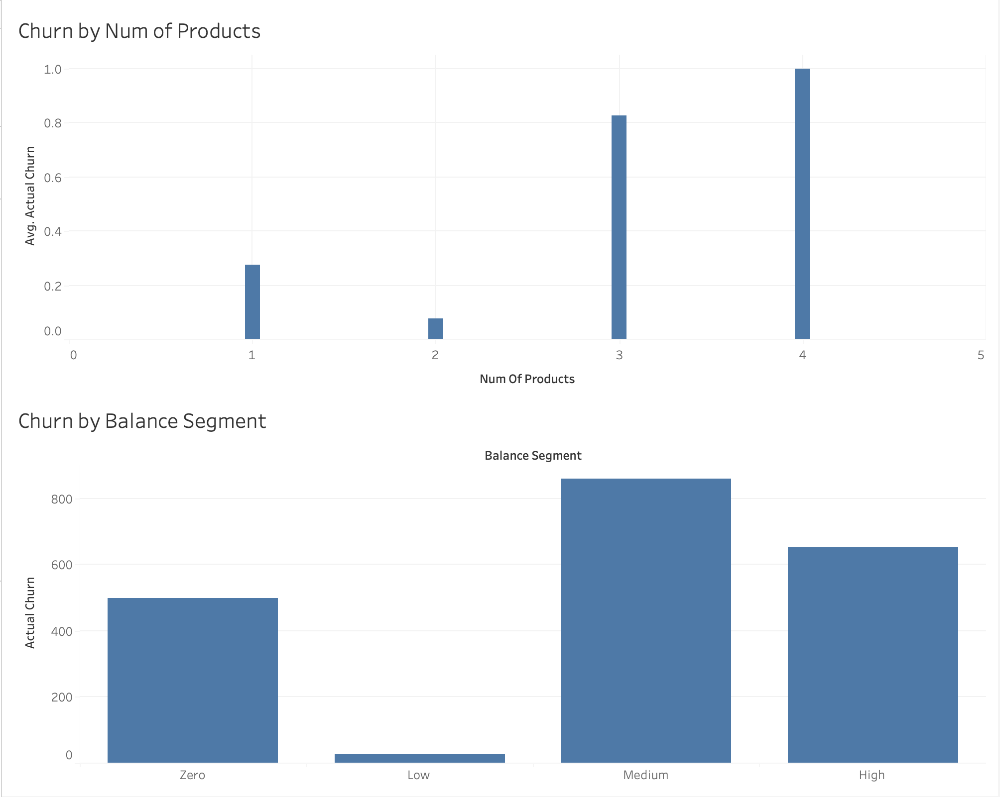
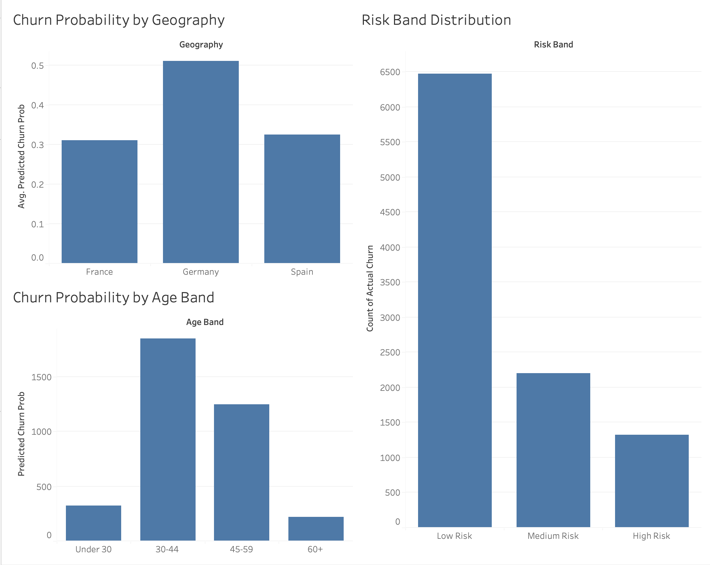
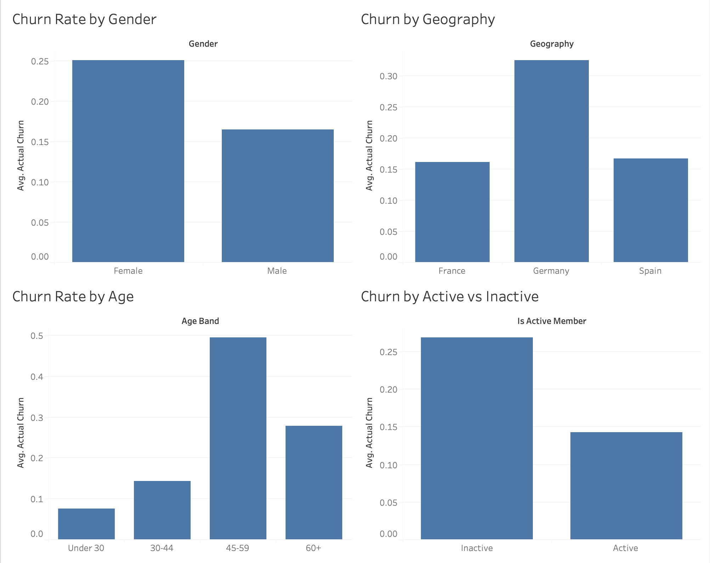

# Bank Customer Churn Prediction

## Overview
End-to-end churn prediction project using a banking dataset of 10,000 customers.
Built in Python with a Tableau dashboard for business insights.

## What this project does
- Exploratory data analysis to identify churn patterns
- Feature engineering (age bands, balance segments, activity flags)
- Two ML models trained and evaluated: Logistic Regression and Random Forest
- Random Forest selected with ROC-AUC of 0.86
- All 10,000 customers scored with churn probability and risk band
- Tableau dashboard built across 3 pages: Executive Overview, Risk Segmentation, Business Drivers

## Key findings
- Germany has double the churn rate of France and Spain (32.4% vs ~16%)
- Customers aged 45-59 churn at 49.4%
- Customers with 3+ products churn at 85.9%
- Inactive members churn at nearly double the rate of active members

## Tech stack
- Python (pandas, numpy, scikit-learn, matplotlib, seaborn)
- Tableau Public
- GitHub

## Files
- churn_project.py — full Python pipeline
- scored_bank_churn.csv — model output with risk bands
- model_feature_importance.csv — Random Forest feature importances
- eda_charts.png — EDA visualisations
- confusion_matrices.png — model evaluation
- roc_curves.png — ROC curve comparison

## Dashboard Preview

### Executive Overview

### Risk Segmentation

### Business Drivers

